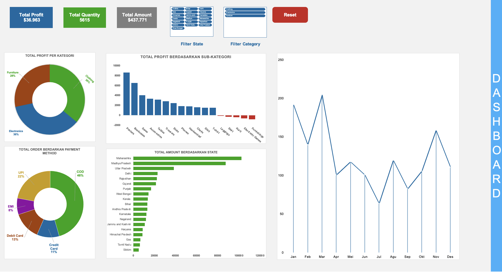

E-Commerce Sales & Profitability Dashboard

*(Dashboard)*

## Ringkasan Proyek (Executive Summary)
Proyek ini bertujuan untuk mengubah data transaksi mentah menjadi **Dashboard Interaktif** yang membantu tim manajemen memantau performa penjualan secara real-time.

Fokus utama analisis ini adalah mengidentifikasi **"Profit Leaks"** (kebocoran profit) pada kategori produk tertentu dan melihat tren penjualan musiman untuk strategi stok barang di masa depan. Dashboard ini dilengkapi dengan fitur otomatisasi VBA untuk meningkatkan pengalaman pengguna (*User Experience*).

---

## Tantangan Bisnis (Business Problem)
Perusahaan E-Commerce memiliki ribuan data transaksi namun kesulitan untuk menjawab pertanyaan strategis dengan cepat:
1.  **Profitabilitas:** Produk mana yang laku keras tapi justru merugikan perusahaan secara margin?
2.  **Regional:** Wilayah (State) mana yang memberikan kontribusi profit terbesar?
3.  **Tren Waktu:** Kapan puncak penjualan terjadi dalam setahun?

---

## Proses Teknis & Tools
Proyek ini dikerjakan 100% menggunakan **Microsoft Excel** dengan alur kerja sebagai berikut:

1.  **Data Preparation (ETL Sederhana):**
    * Membersihkan data mentah (Cleaning).
    * Menggunakan `VLOOKUP` untuk menggabungkan tabel *Orders* (Waktu) dan *Details* (Transaksi) menjadi satu Master Data.
2.  **Data Modeling:**
    * Membuat Pivot Tables untuk agregasi data berdasarkan Kategori, Sub-Kategori, dan Wilayah.
    * Melakukan Grouping tanggal (Bulan/Tahun) untuk analisis Time Series.
3.  **Visualization & UI:**
    * Membuat KPI Cards untuk angka makro (Total Sales, Profit, Quantity).
    * Desain layout tanpa *Gridlines* agar terlihat seperti aplikasi profesional.
4.  **Automation (VBA):**
    * Menulis script VBA untuk mengontrol `SlicerCaches` agar tombol Reset berfungsi pada semua Pivot Table sekaligus.

---

## Key Insights
Berdasarkan eksplorasi data menggunakan dashboard ini, ditemukan bahwa:

* Isu Profitabilitas:** Kategori *Furniture*, khususnya sub-kategori **Tables**, mengalami kerugian signifikan meskipun volume penjualannya tinggi. Disarankan untuk meninjau ulang biaya logistik atau harga jual.
* Tren Musiman:** Penjualan melonjak tajam pada bulan **November & Desember**, mengindikasikan tingginya permintaan saat periode liburan akhir tahun.
* Performa Wilayah:** Wilayah **California** dan **New York** adalah kontributor profit terbesar, sehingga marketing campaign harus difokuskan di area ini.

---

## Cara Menjalankan File
1.  Unduh file `Orders&Details_Dashboard_Analytics.xlsm`.
2.  Buka file menggunakan Microsoft Excel (Windows/Mac).
3.  **PENTING:** Klik **"Enable Macros"** atau **"Enable Content"** saat file dibuka agar tombol Reset berfungsi.
4.  Buka halaman 'Dashboard'
5.  Gunakan Slicer di sebelah kiri untuk memfilter data.
6.  Klik tombol **RESET** untuk kembali ke tampilan awal.

---

*Project ini dibuat sebagai bagian dari portofolio Data Analytics Saya.*
**Tools:** Excel, Pivot Table, VBA, Data Visualization.
