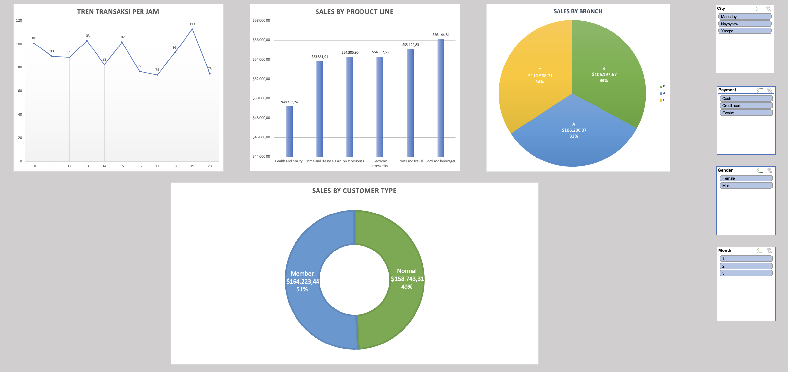

# Laporan Analisis Penjualan Supermarket

## Ringkasan Proyek
Proyek ini bertujuan untuk menganalisis data penjualan supermarket guna mengidentifikasi tren jam sibuk, performa cabang, dan preferensi pelanggan. Dashboard interaktif ini dibuat menggunakan Microsoft Excel untuk membantu manajer toko dalam pengambilan keputusan strategis.

## Dashboard Penjualan

*(Gambar di atas adalah screenshot hasil dashboard interaktif yang telah dibuat)*

## Masalah Bisnis
Manajemen ingin mengetahui:
1. Kapan waktu tersibuk (Peak Hours) untuk optimalisasi jadwal shift karyawan?
2. Produk mana yang menghasilkan pendapatan kotor tertinggi?
3. Bagaimana perbandingan performa antar cabang?

## Temuan Utama (Key Insights)
Berdasarkan analisis data, ditemukan bahwa:
- **Jam Sibuk:** Puncak transaksi terjadi pada pukul **19.00**, sehingga disarankan menambah jumlah kasir pada jam tersebut.
- **Produk Terlaris:** Kategori **Food and Beverages** memberikan kontribusi pendapatan terbesar.
- **Performa Cabang:** Cabang **C** memimpin dalam total penjualan.

## Tools & Teknik yang Digunakan
- **Microsoft Excel** (Data Cleaning, Pivot Table, Pivot Chart)
- **Data Visualization** (Line Chart, Bar Chart, Donut Chart)
- **Slicers** (Untuk filter interaktif berdasarkan Gender, Cabang, dan Tipe Pelanggan)

---
*Proyek ini dibuat sebagai bagian dari portofolio Data Analysis.*

